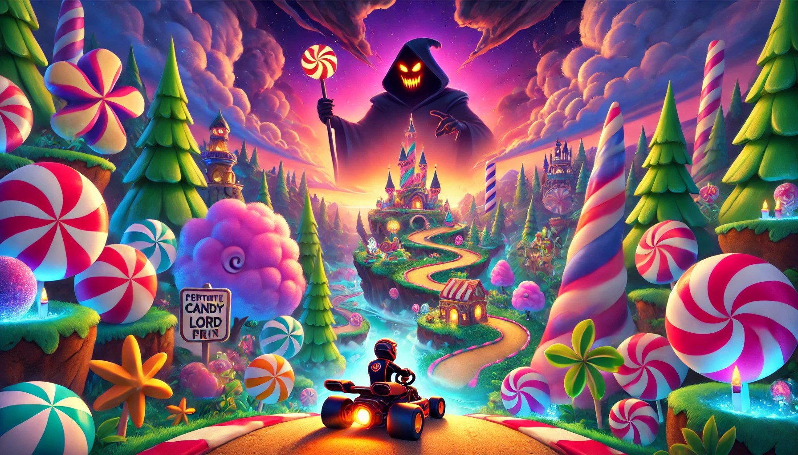

# Candy Rush Grand Prix

## Overview
Candy Rush Grand Prix is a candy-themed go-kart racing game inspired by the classic Diddy Kong Racing N64 Adventure mode. Players can explore various candy biomes, each offering unique challenges and aesthetics, all centered around the majestic Candy Castle Central. The adventure mode emphasizes exploration, discovery, and intense races through candy-themed worlds, allowing players to unlock new areas and progress through an engaging storyline.

## Funding
This project is currently seeking funding to further develop features, enhance game mechanics, and support the creative team. Interested sponsors or donors can contact us through our Discord server or directly via email provided in our GitHub profile.

## Collaborating
Join our development community on Discord to discuss game development, suggest new features, and collaborate with other developers and designers.
[Join our Discord](https://discord.gg/ErH8eNM2)

## Contributing
Interested in contributing to Candy Rush Grand Prix? Contributors are welcome to propose enhancements, fix bugs, or improve documentation. Please feel free to send a pull request or open an issue.

# In Planning Stages and Development

## Biomes
- **Candy Castle Central (in development)**: The main hub connecting all biomes, where players can navigate to different biomes.
- **Peppermint Candy Forest (planned)**: Features icy paths, towering peppermint trees, and slippery slopes.
- **Licorice Lagoon (planned)**: Dark waters with slick licorice bridges and obstacles that stick to your kart.
- **Toffee Tundra (planned)**: Frosty toffee-covered landscapes with snowy mountains and frozen roads.
- **Gummy Bear Valley (planned)**: Colorful and bouncy terrain filled with giant gummy bears.
- **Bubblegum Dunes (planned)**: A desert-like biome with roads made of stretched bubblegum that expands and contracts.
- **Lollipop Lushlands (planned)**: A vibrant landscape of towering lollipop trees, rainbow paths, and swirling gusts of wind.
- **Caramel Caves (planned)**: A cavernous network filled with sticky caramel pits, molten geysers, and narrow, winding roads.

## Game Features
- **Local/Online Multiplayer (planned)**: Race with up to 4 friends in split-screen mode or up to 8 players online.
- **Battle Modes (planned)**: Compete in online or local play in candy-filled arenas with sweet power-ups.
- **Adventure Mode Story (in development)**: Explore Candy Castle Central and unlock new tracks and vehicles by collecting biome keys and defeating biome bosses.
- **Items and Power-ups (in development)**: Use candy-themed items, such as the Gumdrop Shield, to boost your kart or hinder opponents.
- **Candy Kart Customization (in development)**: Players can customize their karts and candy trails for a more personalized racing experience.
- **Interactive Biome Puzzles (planned)**: Solve biome-specific puzzles to unlock new areas and races after obtaining specific biome keys.

## Installation
To play Candy Rush Grand Prix, clone this repository and import it into Unreal Engine 5.4
```bash
git clone https://github.com/phoenixgoldz/candyrushgrandprix.git
